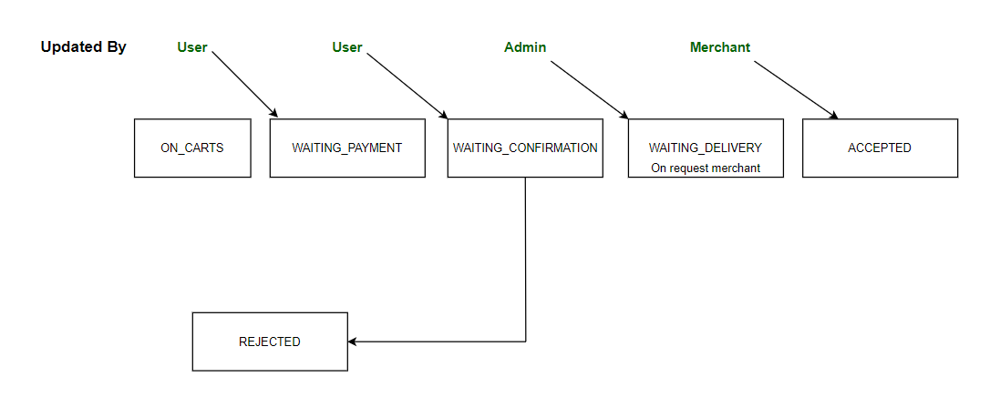
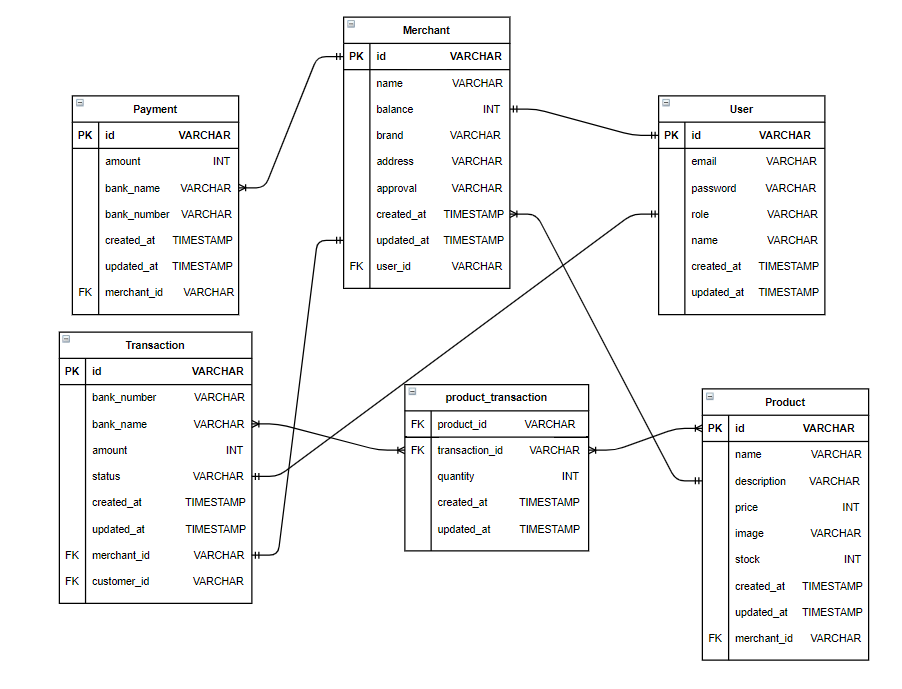

# sea-apd
Project for compfest 12 Software Engineering Academy by APD team

`sea-apd` is an E-Commerce that help customers to buy what they want from top merchants

it's a RESTFUL API that can be used through here [here](http://137.116.136.106) and the documentation with swagger [here](http://137.116.136.106/docs/index.html)

## Project structure (Based on Clean Architecture)

```sh
sea-apd/
├── common              # Used for utilities and reusable function
      ├── auth          # Related to authentication proccess i.e. JWT Token, hash password 
      ├── constant      # Constant value that will be used (usecase, dto, controller and route) to avoid hardcoded value
      ├── mailer        # To handle mail request
      ├── observer      # Observerable for notifying all observer 
├── controller          # Responsible for responding from outside user input and perform interaction in application 
      ├── http          # Entry point based on HTTP method
├── domain              # Contains declaration of structs and contract for repository, usecase and controller
├── dto                 # Contains data transfer object such as request, response and domain
      ├── domain        # Used to encapsulate custom domain into object  
      ├── request       # Used to encapsulate request into object  
      ├── response      # Used to encapsulate response into object  
├── infrastucture       # Contains tech from outside application except library
      ├── db            # Contains database driver
      ├── nginx         # Contains nginx configuration
├── mocks               # Contains all mocks for testing purpose
      ├── file          # Contains file mock for testing on file upload
      ├── postgres      # Contains mock postgres driver for testing on database in repository
      ├── repository    # Contains mock repository
      ├── usecase       # Contains mock usecase
├── repository          # To handle operation to database
      ├── postgres      # Repository that implemented using postgres database
├── routes              # Declare initial configuration such as depedency injection, database migration, etc
├── usecase             # To handle business logic on domain
```

## Included design pattern
   - Observer
      - Used on action that triggered if transaction status is changed, for example sending email to admin when there are transaction paid
   - Abstract factory
      - Used on creating type of mailer, ex: auth mailer and transaction mailer
   - Singleton
      - Used on database driver and mail driver
   - Facade
      - Used on hashing, controller, etc

## Features
  - Register Customer, Merchant and Admin
  - Reject Merchant proposal
  - Login
  - Update profile Merchant and Customer
  - CRUD Products
  - Get Merchant products
  - Update Merchant balance
  - CRUD transaction (cart)
  - Submit payment
  - Get list requested item
  - Reject transaction
  - View transaction histories
  
## How to start application
- Install depedencies by running `go mod download`
- Make `.env` file in project root directory and copy `.env.example` file content 
- Fill the environment variables
- Run `go run main.go` in project root and its working now :)
### Notes
- To build image just run `docker build -t <YOUR_IMAGE_TAGS>:<IMAGE_VERSION> .`
- There are nginx dockerfile on infrastructure/nginx and you can also build nginx image with same command as step before but make sure to run the command in nginx directory
- For testing in admin role, admin token is "adminToken"

## Transaction Flow

- ON_CARTS
Created when customer inserted item to cart
- WAITING_PAYMENT
Updated when customer confirmed their payment in cart
- WAITING_CONFIRMATION
Updated when customer paid the transaction, it will **trigger** action to send email to admin to confirm the payment and invoice to user
- REJECTED
Updated when admin rejected the transaction
- WAITING_DELIVERY
Updated when admin accepted the transaction, it will **trigger** action to send email to merchant to confirm and deliver the item request
- ACCEPTED
Updated when merchant accept the request, it will **trigger** action to send email to user about the item has been arrived


## Entity Relationship Diagram


## Tech Stack
Database:
- Postgresql
CI/CD:
- Docker
- Github actions
Documentation:
- Swagger
Cloud provider:
- Microsoft azure (azure VM)
Others:
- Nginx
- Mailgun
